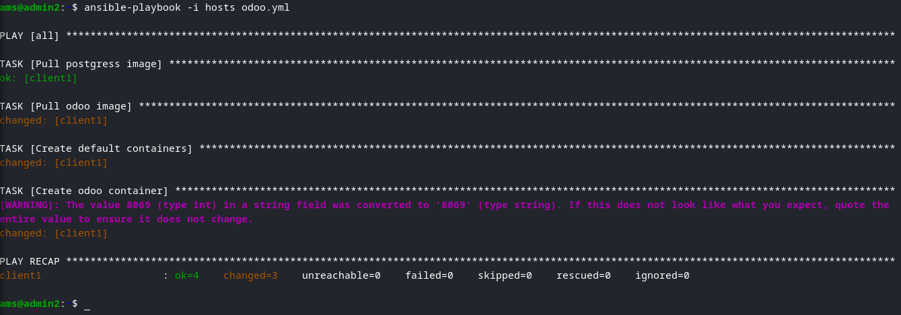
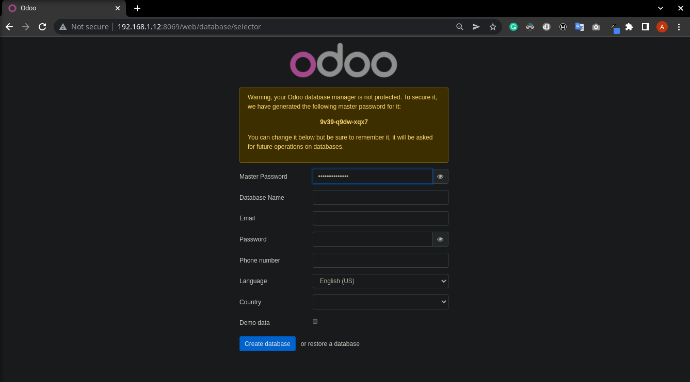

# Ansible odoo installer

## Table of Contents

- [About](#about)
- [Getting Started](#getting_started)
- [Usage](#usage)
- [ScreenShots](#screenshots)

## About <a name = "about"></a>

An automated docker and odoo installer using ansible in a remote client.
scripts made for docker ce under ubuntu

<p align="right">(<a href="#top">back to top</a>)</p>

## Getting Started <a name = "getting_started"></a>

These instructions will get you a copy of the project up and running on your local machine for development and testing purposes.

### >Prerequisites

[ansibe](https://www.ansible.com)
```
sudo apt install ansiple
```

### >Running

1) clone the repo
    ```
    git clone
    ```

2) edit the host file add your remote server ip address and login data
3) make sure it is all connected
    ```
    ansible -i host -m ping
    ```
    -you may get an error of using ssh password instead of a key, edit /etc/ansible/ansible.cfg, add or uncomment and repeat step 2

    ```
    [defaults]
    host_key_checking = False
    ```
4) now that ansible is working we can install docker
    ```
    ansible-playbook -i host docker.yml
    ```

5) install odoo
    ```
    ansible-playbook -i host odoo.yml
    ```

6) open port in firewall, to access the Odoo Web interface from outside the server where you have installed it using the docker, we have to open its port 8069 on the system.
    ```
    sudo ufw allow 8069
    ```

<p align="right">(<a href="#top">back to top</a>)</p>

## Usage <a name = "usage"></a>

1) Go to any PC or Laptop that can access the <Server ip-address> where you have installed the Docker and its container. After that, open the browser and point it to the server-ip-address along with port number 8069.
    ```
    http://192.168.6.12:8069
    ```

2) Enter the required information and create a database
-voilla you have an oddo installed in a docker in your remote server.

<p align="right">(<a href="#top">back to top</a>)</p>

## Screenshots <a name ="screenshots"></a>
terminal odoo installation



odoo main page in the browser


<p align="right">(<a href="#top">back to top</a>)</p>
